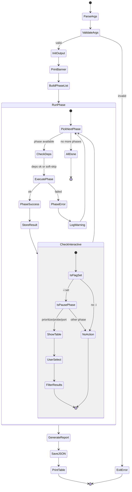
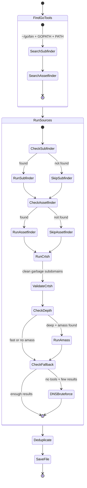
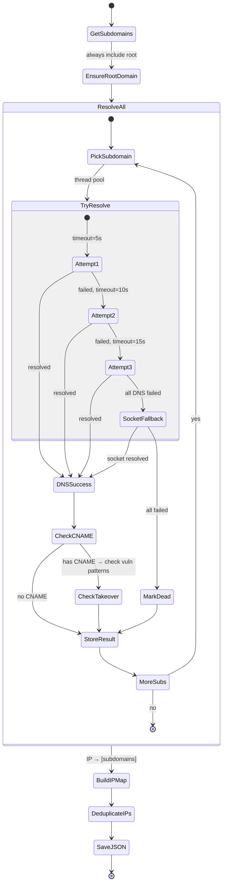
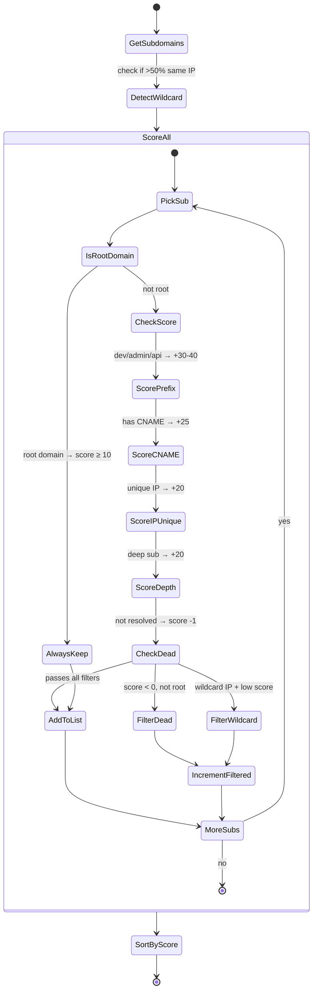
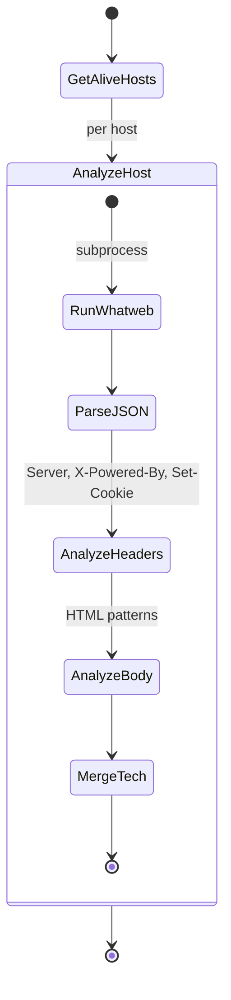
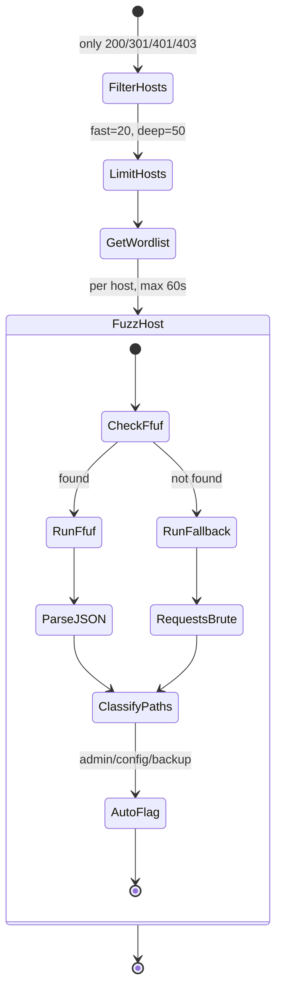
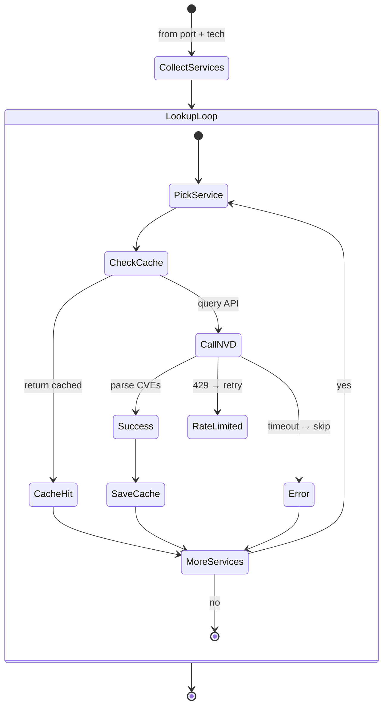
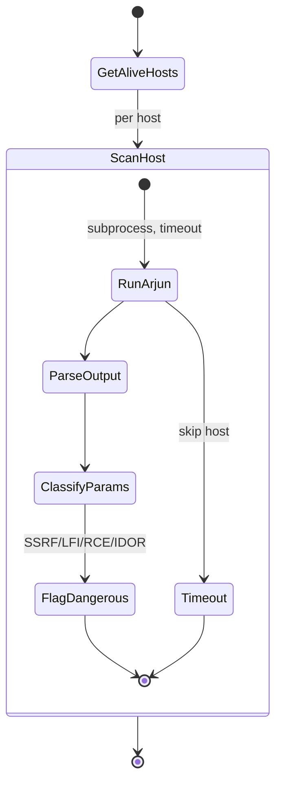
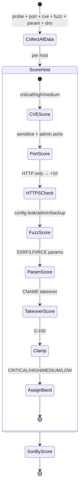
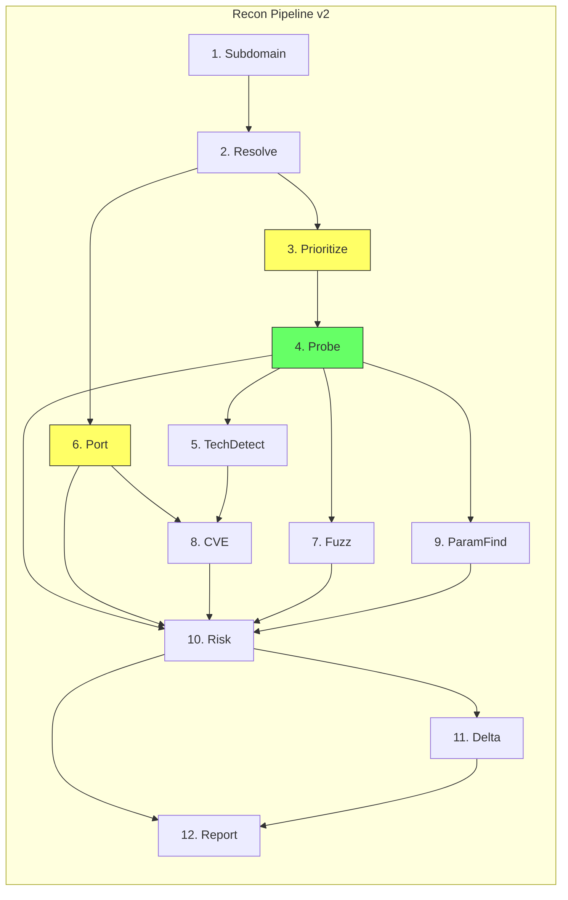

# ReconRisk v2 — State Machines

Tài liệu mô tả state machine cho từng phase và interactive pipeline.

---

## 1. Pipeline State Machine (Tổng thể + Interactive)



### Interactive Pauses
| Pause | After Phase | Table Shows | User Selects |
|-------|-------------|-------------|-------------|
| 1 | prioritize | Score, subdomain, tags, IPs | By number, tag, or top N |
| 2 | probe | Status, host, title, server, TLS | By number or top N |
| 3 | port | Host, IP, open ports, OS | By number or top N |

---

## 2. Subdomain Phase (`subdomain.py`)



### Sources & Fallback
| Source | Mode | Notes |
|--------|------|-------|
| subfinder | fast + deep | Searches ~/go/bin/ directly |
| assetfinder | all | Optional, skipped if missing |
| crt.sh | all | Always available, cleans garbage |
| amass | deep only | Slow, passive enum |
| DNS bruteforce | fallback | 53 prefixes if no tools found |

---

## 3. DNS Resolve Phase (`dns_resolve.py`)



---

## 4. Prioritize Phase (`prioritize.py`)



---

## 5. HTTP Probe Phase (`http_probe.py`)

```mermaid
stateDiagram-v2
    [*] --> GetInput
    GetInput --> HandlePrioritized : list of dicts
    GetInput --> HandleRaw : list of strings
    HandlePrioritized --> ExtractSubdomains
    HandleRaw --> ExtractSubdomains

    ExtractSubdomains --> FindGoHttpx : ~/go/bin/httpx
    FindGoHttpx --> UseGoHttpx : found
    FindGoHttpx --> UseFallback : not found

    UseGoHttpx --> ParseJSONLines --> BuildProbes
    UseFallback --> ThreadPool --> RequestsGet --> BuildProbes

    BuildProbes --> [*]
```

---

## 6. Tech Detect Phase (`tech_detect.py`)



### Detection Sources
| Source | Detects |
|--------|---------|
| whatweb | CMS, framework, server, language |
| HTTP headers | Server, X-Powered-By, cookies |
| HTML body | WordPress, Next.js, React, Angular |

---

## 7. Port Scan Phase (`port_scan.py`)

```mermaid
stateDiagram-v2
    [*] --> GetTargets
    GetTargets --> UseUniqueIPs : from resolve phase
    GetTargets --> UseSubdomains : fallback

    UseUniqueIPs --> LimitTargets : max 50
    UseSubdomains --> LimitTargets

    LimitTargets --> BuildNmapCmd
    BuildNmapCmd --> NmapFast : fast → top 100, -sV
    BuildNmapCmd --> NmapDeep : deep → top 1000, -sV -O

    NmapFast --> RunNmap
    NmapDeep --> RunNmap
    RunNmap --> ParseXML --> ExtractPorts --> [*]
```

---

## 8. Web Fuzz Phase (`web_fuzz.py`)



---

## 9. CVE Lookup Phase (`cve_lookup.py`)



---

## 10. Param Find Phase (`param_find.py`)



---

## 11. Risk Score Phase (`risk_score.py`)



---

## 12. Phase Dependencies (v2)



> [!IMPORTANT]
> Phases có viền vàng/xanh là **interactive pause points** khi dùng `-i`.
> Dependencies là **soft** — phase vẫn chạy nếu deps thiếu data.
