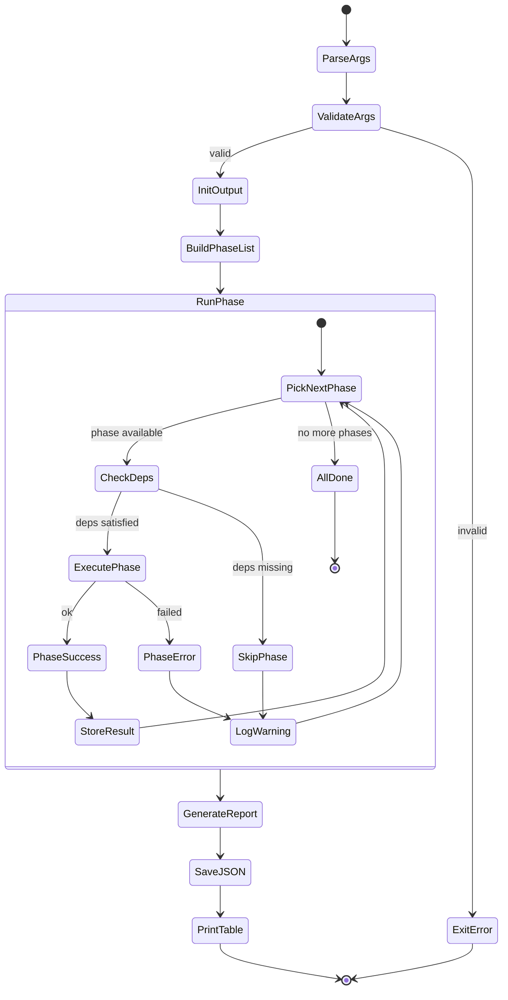
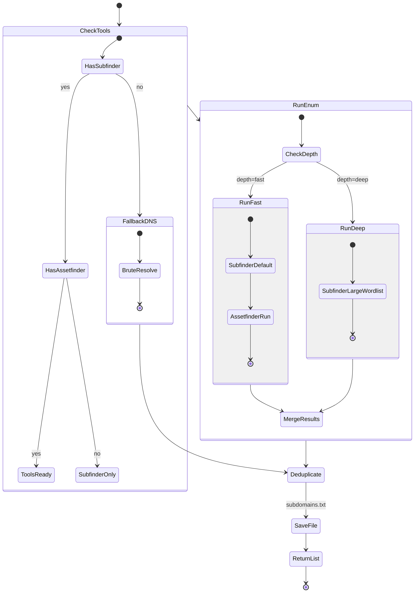
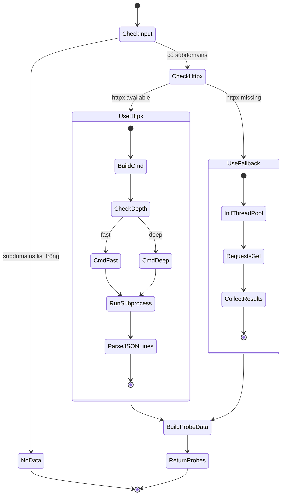
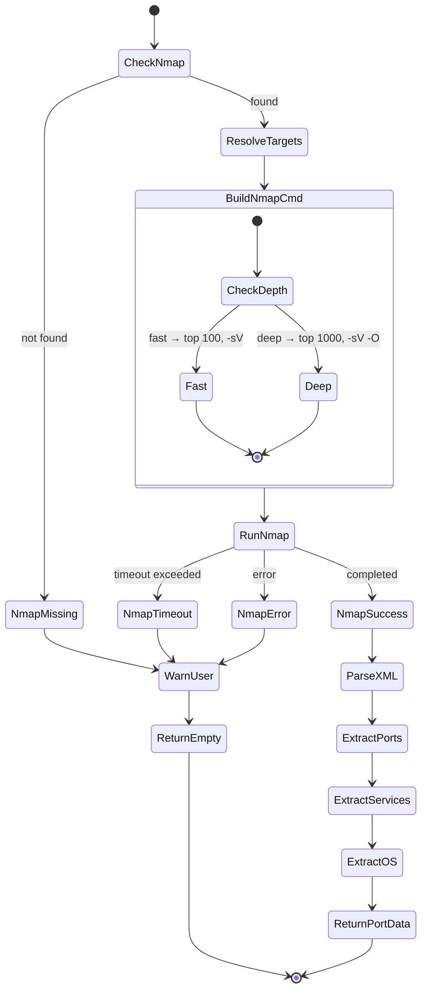
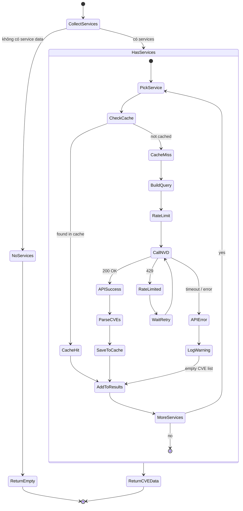
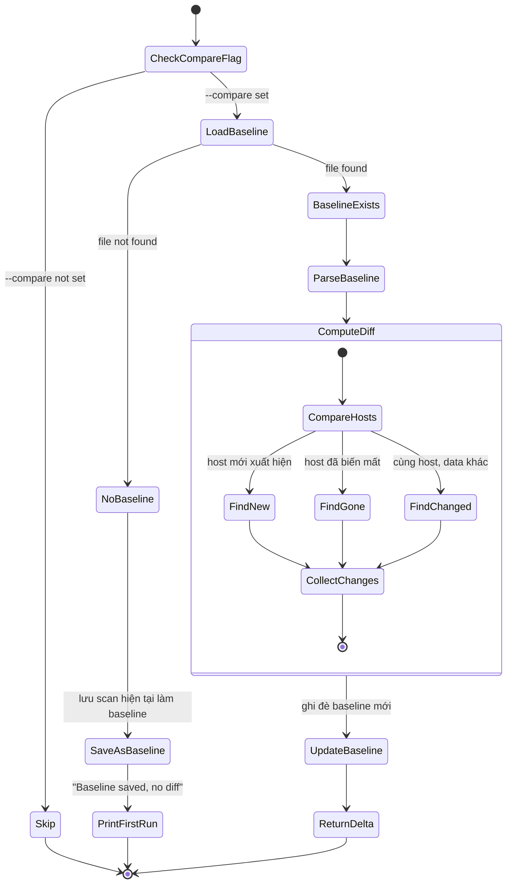
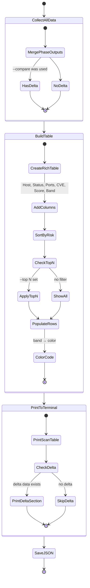
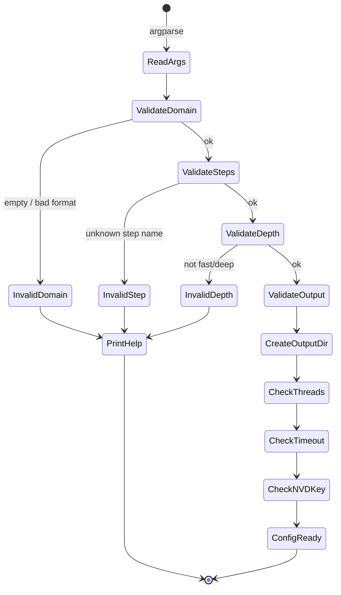
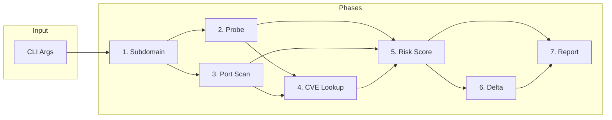

# ReconRisk — State Machines

Tài liệu này mô tả state machine cho từng thành phần của ReconRisk, giúp hiểu rõ luồng xử lý trước khi bắt tay vào code.

---

## 1. Pipeline State Machine (Tổng thể)

Điều khiển toàn bộ flow từ CLI → chạy từng phase → output.

### Giải thích
- **ParseArgs** → **ValidateArgs**: Kiểm tra domain hợp lệ, steps/depth đúng format
- **BuildPhaseList**: Từ `--steps` hoặc `--all`, xây danh sách phase theo thứ tự
- **CheckDeps**: Ví dụ phase `risk` cần data từ `probe` + `cve`. Nếu user chỉ chạy `--steps risk`, skip vì thiếu input
- **PhaseError → LogWarning**: Graceful degradation — không crash cả pipeline

---

## 2. Subdomain Phase (`subdomain.py`)

### States chính
| State | Mô tả |
|-------|--------|
| `CheckTools` | Kiểm tra subfinder/assetfinder có trong PATH |
| `RunFast` | Chạy cả subfinder + assetfinder mặc định |
| `RunDeep` | Subfinder với wordlist lớn |
| `FallbackDNS` | Dùng dnspython nếu không có tool nào |
| `Deduplicate` | Loại bỏ subdomain trùng lặp |

---

## 3. HTTP Probe Phase (`http_probe.py`)

### States chính
| State | Mô tả |
|-------|--------|
| `CmdFast` | httpx: status, title, server |
| `CmdDeep` | + follow redirects, HTTPS check, tech headers |
| `UseFallback` | requests.get() với thread pool nếu thiếu httpx |
| `BuildProbeData` | Chuẩn hóa output thành `{url, status, title, server}` |

---

## 4. Port Scan Phase (`port_scan.py`)

### States chính
| State | Mô tả |
|-------|--------|
| `CheckNmap` | Kiểm tra nmap có trong PATH |
| `Fast/Deep` | Top 100 vs top 1000 ports |
| `ParseXML` | Parse nmap `-oX -` XML output |
| `ExtractPorts/Services/OS` | Trích dữ liệu từ XML tree |

---

## 5. CVE Lookup Phase (`cve_lookup.py`)

### States chính
| State | Mô tả |
|-------|--------|
| `CheckCache` | Xem `cve_cache.json`, tránh gọi API lại |
| `RateLimit` | Sleep 0.6s (có key) hoặc 6s (không key) |
| `CallNVD` | Gọi NVD API v2 keywordSearch |
| `RateLimited` | Nhận 429 → chờ rồi retry |
| `SaveToCache` | Lưu kết quả vào disk cache |

---

## 6. Risk Score Phase (`risk_score.py`)

```mermaid
stateDiagram-v2
    [*] --> CollectHostData

    state CollectHostData {
        [*] --> GatherProbe
        GatherProbe --> GatherPorts
        GatherPorts --> GatherCVEs
        GatherCVEs --> [*]
    }

    CollectHostData --> ScoreHosts

    state ScoreHosts {
        [*] --> PickHost
        PickHost --> InitScore : score = 0

        InitScore --> CheckCriticalCVE
        CheckCriticalCVE --> AddCVSS9Plus : CVSS >= 9.0 → +40
        CheckCriticalCVE --> CheckHighCVE

        AddCVSS9Plus --> CheckHighCVE
        CheckHighCVE --> AddCVSS7Plus : CVSS 7-8.9 → +25
        CheckHighCVE --> CheckMedCVE

        AddCVSS7Plus --> CheckMedCVE
        CheckMedCVE --> AddCVSSMed : CVSS 4-6.9 → +10 (max +20)
        CheckMedCVE --> CheckPorts

        AddCVSSMed --> CheckPorts
        CheckPorts --> AddSensitive : 22,3306,5432... → +15
        CheckPorts --> CheckAdminPorts

        AddSensitive --> CheckAdminPorts
        CheckAdminPorts --> AddAdmin : 8080,9000... → +10
        CheckAdminPorts --> CheckHTTPS

        AddAdmin --> CheckHTTPS
        CheckHTTPS --> AddHTTPOnly : HTTP only → +10
        CheckHTTPS --> ClampScore

        AddHTTPOnly --> ClampScore
        ClampScore --> AssignBand : cap 0-100

        AssignBand --> MoreHosts
        MoreHosts --> PickHost : yes
        MoreHosts --> [*] : no
    }

    ScoreHosts --> SortByScore
    SortByScore --> ReturnScored
    ReturnScored --> [*]
```

### Risk Bands
| Score | Band | Emoji |
|-------|------|-------|
| ≥ 70 | CRITICAL | 🔴 |
| 50–69 | HIGH | 🟠 |
| 30–49 | MEDIUM | 🟡 |
| < 30 | LOW | 🟢 |

---

## 7. Delta Phase (`delta.py`)

### Delta output types
| Tag | Ý nghĩa |
|-----|---------|
| `[NEW]` | Host/port/CVE mới xuất hiện |
| `[GONE]` | Host/port đã offline |
| `[CHANGED]` | Risk score thay đổi, CVE mới |

---

## 8. Report Phase (`report.py`)

---

## 9. CLI Validation Flow (chi tiết `recon.py`)

---

## Tổng kết Phase Dependencies

> [!IMPORTANT]
> Mỗi phase có thể chạy độc lập nếu user cung cấp `--steps` cụ thể, nhưng nếu thiếu data từ phase trước thì sẽ **skip** thay vì crash.
